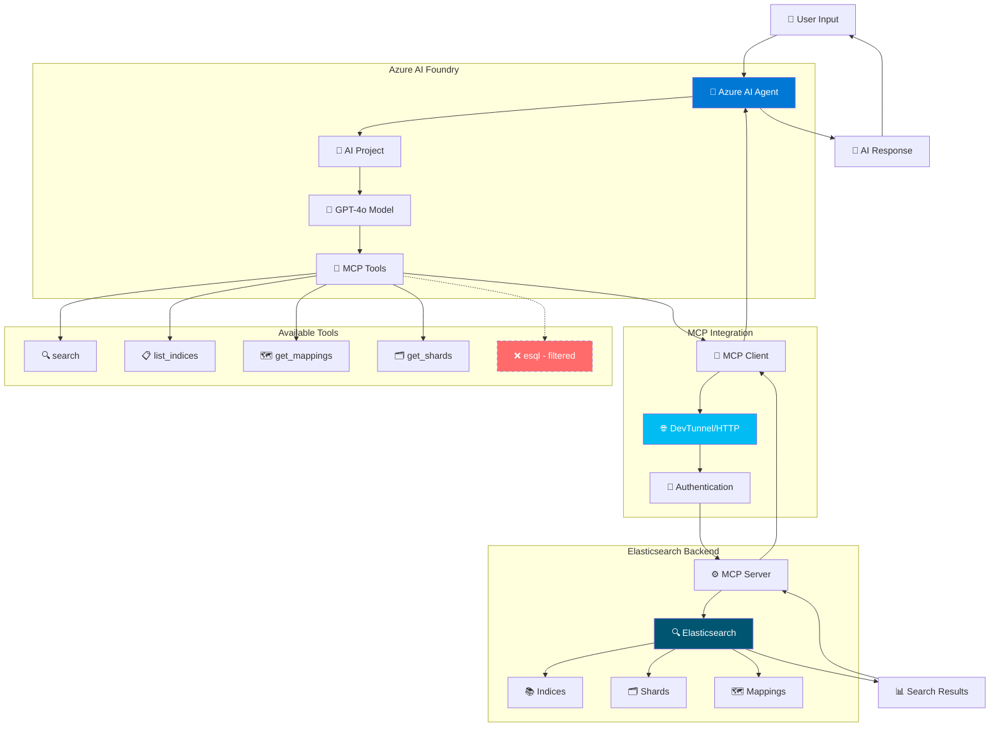

# Azure AI Foundry Agent with MCP Server Integration

This project demonstrates how to create an Azure AI Foundry agent in Python that connects to an MCP (Model Context Protocol) server for Elasticsearch integration. The agent can search, analyze, and interact with Elasticsearch data through natural language conversations using Azure's latest AI capabilities.

## 🚀 Features

- **🤖 Azure AI Foundry Integration**: Uses the latest Azure AI Projects SDK for agent creation and management
- **🔌 MCP Server Communication**: Connects to MCP servers for Elasticsearch integration via HTTP/DevTunnel
- **🛡️ Tool Filtering**: Smart filtering of MCP tools (excludes `esql` by default for safety)
- **🌐 DevTunnel Support**: Secure remote access through Azure DevTunnels with authentication
- **🔍 Elasticsearch Tools**: Complete search, mapping, shard info, and analysis capabilities
- **🔒 Secure Configuration**: All credentials and URLs stored in environment variables
- **⚡ Comprehensive Error Handling**: Robust error handling and detailed logging throughout
- **🎯 Async/Await Support**: Fully asynchronous implementation for optimal performance
- **🧪 Production-Ready Testing**: Organized test suite with authentication, integration, and functional tests

## 📊 Architecture & Workflow



## 🔄 Tool Filtering Strategy

The agent implements intelligent tool filtering to ensure safe and appropriate tool usage:

- **✅ Enabled Tools**: `search`, `list_indices`, `get_mappings`, `get_shards`
- **❌ Filtered Tools**: `esql` (ES|QL queries filtered for safety and complexity management)
- **🎯 Configurable**: Tool filtering can be customized via configuration

## 📋 Prerequisites

### Azure Requirements
- **Azure AI Foundry Project**: Set up with appropriate region and configuration
- **Azure RBAC**: Azure AI User role assigned at project scope
- **Model Deployment**: GPT-4o (or compatible) deployed in your Azure AI Foundry project
- **Azure CLI**: Installed and authenticated (`az login`)

### Local Development Requirements
- **Python 3.8+**: With pip package manager
- **MCP Server**: Running and accessible (localhost:8080/mcp or DevTunnel URL)
- **Elasticsearch**: Instance accessible from MCP server
- **DevTunnel (Optional)**: For secure remote MCP server access

### DevTunnel Setup (for Remote MCP Server)
If using Azure DevTunnels for remote MCP server access:

1. **Install DevTunnel CLI**:
   ```bash
   # Install via winget (Windows) or download from Microsoft
   winget install Microsoft.devtunnel
   ```

2. **Create and Start Tunnel**:
   ```bash
   # Login to DevTunnel
   devtunnel user login
   
   # Create tunnel (run on server with MCP)
   devtunnel create --allow-anonymous
   
   # Start hosting (replace with your port)
   devtunnel host -p 8080 --allow-anonymous
   ```

3. **Get DevTunnel URL**: Copy the HTTPS URL provided (e.g., `https://abc123.use.devtunnels.ms:8080/mcp`)

## ⚙️ Installation & Setup

1. **Clone the Repository**:
   ```bash
   git clone <your-repo-url>
   cd mcp-agent-python
   ```

2. **Create Virtual Environment (Recommended)**:
   ```bash
   python -m venv venv
   source venv/bin/activate  # On Windows: venv\Scripts\activate
   ```

3. **Install Dependencies**:
   ```bash
   pip install -r requirements.txt
   ```

4. **Configure Environment Variables**:
   ```bash
   cp .env.example .env
   ```
   
   **Edit `.env` with your actual values**:
   ```bash
   # Azure AI Foundry Configuration
   PROJECT_ENDPOINT=https://<AIFoundryResourceName>.services.ai.azure.com/api/projects/<ProjectName>
   MODEL_DEPLOYMENT_NAME=gpt-4o-mini
   
   # MCP Server Configuration (choose one)
   # For local MCP server:
   MCP_SERVER_URL=http://localhost:8080/mcp
   
   # For DevTunnel MCP server:
   MCP_SERVER_URL=https://your-tunnel-id.use.devtunnels.ms:8080/mcp
   DEVTUNNEL_ACCESS_TOKEN=your_devtunnel_token_here
   
   # Elasticsearch Configuration (used by MCP server)
   ELASTICSEARCH_INDEX=nyc-art-galleries
   ```

5. **Authenticate with Azure**:
   ```bash
   az login
   ```

6. **Verify Setup**:
   ```bash
   ./run_tests.sh check
   ```

## 🎯 Getting Your Azure AI Foundry Configuration

### 1. Project Endpoint
1. Navigate to [Azure AI Foundry Studio](https://ai.azure.com/)
2. Select your project
3. Go to **Management** → **Azure AI Services**
4. Copy the endpoint URL format: `https://<resource>.services.ai.azure.com/api/projects/<project>`

### 2. Model Deployment Name
1. In your Azure AI Foundry project
2. Navigate to **Models + Endpoints** → **Deployments**
3. Copy the **deployment name** (not the model name)
4. Common deployments: `gpt-4o-mini`, `gpt-4o`, `gpt-35-turbo`

### 3. DevTunnel Authentication (if using DevTunnels)
1. When starting DevTunnel, note the access token in the output
2. Add this token to your `.env` as `DEVTUNNEL_ACCESS_TOKEN`
3. The MCP client will automatically include this for authentication

## 🚀 Usage

### 🔨 Quick Start Example

```python
import asyncio
from azure_ai_agent import AzureAIMCPAgent

async def main():
    async with AzureAIMCPAgent() as agent:
        # Create agent with tool filtering (excludes esql by default)
        await agent.create_agent()
        await agent.create_thread()
        
        # Send a natural language query
        await agent.send_message(
            "Search for art galleries in Manhattan and show me 3 examples"
        )
        
        # Get AI response with Elasticsearch results
        result = await agent.run_agent()
        
        # Display the conversation
        for message in reversed(result['messages']):
            role = message['role'].upper()
            content = message['content']
            print(f"{role}: {content}")
            print("-" * 50)

if __name__ == "__main__":
    asyncio.run(main())
```

### 🎮 Interactive Examples

Run the comprehensive examples that demonstrate different capabilities:

```bash
# Run all examples
python examples.py

# Or run individual examples
python -c "
import asyncio
from examples import example_basic_search
asyncio.run(example_basic_search())
"
```

**Available Examples:**
- **Basic Search**: Simple Elasticsearch queries through natural language
- **Filtered Tool Usage**: Demonstrates tool filtering in action
- **Multi-turn Conversation**: Extended dialogue with context retention
- **Error Handling**: How the agent handles various error conditions

### 🔧 Advanced Usage

**Custom Tool Filtering:**
```python
# Create agent with custom tool exclusions
agent = AzureAIMCPAgent(excluded_tools=['esql', 'get_shards'])
```

**DevTunnel Authentication:**
```python
# MCP client automatically handles DevTunnel authentication
# when DEVTUNNEL_ACCESS_TOKEN is set in environment
```

**Connection Validation:**
```python
# Test MCP server connection
python -c "
import asyncio
from mcp_client import MCPClient

async def test():
    async with MCPClient() as client:
        tools = await client.list_tools()
        print(f'Available tools: {[tool.name for tool in tools]}')

asyncio.run(test())
"
```

## 📁 Project Structure

```
mcp-agent-python/
├── 📄 azure_ai_agent.py           # 🤖 Main Azure AI agent implementation
├── 📄 config.py                   # ⚙️ Configuration management with validation
├── 📄 mcp_client.py               # 📡 MCP server communication client
├── 📄 elasticsearch_tools.py      # 🔧 Custom Elasticsearch tools (legacy)
├── 📄 examples.py                 # 📚 Comprehensive usage examples
├── 📄 requirements.txt            # 📦 Python dependencies
├── 📄 .env.example               # 📋 Environment variables template
├── 📄 .env                       # 🔒 Your actual environment variables
├── 📄 .gitignore                 # 🚫 Git ignore rules
├── 🗂️ tests/                     # 🧪 Comprehensive test suite
│   ├── 📄 README.md              # 📖 Testing documentation
│   ├── 📄 run_tests.py           # 🏃 Python test runner
│   ├── 🗂️ auth/                  # 🔐 Authentication tests
│   │   └── test_devtunnel_auth.py
│   ├── 🗂️ integration/           # 🔗 End-to-end integration tests
│   │   ├── test_mcp_setup.py
│   │   ├── test_agent_filtering.py
│   │   └── test_nyc_galleries.py
│   └── 🗂️ archive/               # 📚 Archived test files (reference)
├── 🗂️ scripts/
│   └── 📄 run_tests.sh           # 🏃 Main test runner script
└── 📄 README.md                  # 📖 This comprehensive guide
```

## 🏗️ Key Components

### 🤖 AzureAIMCPAgent
**The orchestration layer** that manages:
- 🏢 Azure AI Foundry client initialization and project management
- 🔌 MCP server connection with automatic retry and error handling
- 🛡️ Intelligent tool integration with configurable filtering
- 💬 Conversation management and context retention
- 🧹 Automatic resource cleanup and memory management

### 📡 MCPClient
**Communication bridge** handling:
- 🔍 Tool discovery and enumeration from MCP servers
- ⚡ Async tool execution with timeout management
- 🔐 DevTunnel authentication and secure connections
- 🛠️ Error handling with detailed diagnostics
- 🔄 Connection lifecycle management

### ⚙️ Configuration Management
**Environment-driven setup** providing:
- 🔒 Secure credential management via environment variables
- ✅ Configuration validation with helpful error messages
- 🎯 Flexible deployment options (local/DevTunnel/cloud)
- 📋 Comprehensive defaults for common scenarios

### 🧪 Testing Infrastructure
**Production-ready validation** including:
- 🔐 Authentication testing (Azure CLI + DevTunnel)
- 🔗 Integration testing with real MCP servers
- 🛡️ Tool filtering validation and security checks
- 📊 Performance and reliability testing

## ⚙️ Configuration Reference

The agent supports extensive configuration through environment variables:

| Variable | Description | Default | Required |
|----------|-------------|---------|----------|
| `PROJECT_ENDPOINT` | Azure AI Foundry project endpoint | - | ✅ |
| `MODEL_DEPLOYMENT_NAME` | Model deployment name | - | ✅ |
| `MCP_SERVER_URL` | MCP server URL (HTTP/DevTunnel) | `http://localhost:8080/mcp` | ❌ |
| `DEVTUNNEL_ACCESS_TOKEN` | DevTunnel authentication token | - | ❌* |
| `ELASTICSEARCH_INDEX` | Default Elasticsearch index | `default` | ❌ |
| `AGENT_NAME` | Custom agent identifier | `elasticsearch-mcp-agent` | ❌ |
| `AGENT_INSTRUCTIONS` | Custom system prompt | See config.py | ❌ |

*Required if using DevTunnel URLs

### 🔧 Advanced Configuration

**Custom Agent Instructions:**
```bash
AGENT_INSTRUCTIONS="You are a specialized Elasticsearch assistant focused on NYC art galleries. Always provide detailed, accurate information about gallery locations, exhibitions, and visiting hours."
```

**Tool Filtering Options:**
- Default: Excludes `esql` for safety
- Configurable via agent initialization
- Can be customized per use case

## 🛡️ Security & Best Practices

Following Azure and security development best practices:

- **🔒 Zero Hardcoded Credentials**: All sensitive data managed via environment variables
- **🛡️ DefaultAzureCredential**: Uses Azure's recommended authentication pattern
- **✅ Input Validation**: Comprehensive validation of configuration and user inputs
- **🔐 Secure Communication**: HTTPS enforced for all Azure and DevTunnel connections
- **🎯 Minimal Permissions**: Agent uses least-privilege access patterns
- **🛡️ Tool Filtering**: Smart exclusion of potentially unsafe tools (like `esql`)
- **📝 Audit Logging**: Comprehensive logging for security monitoring
- **🔄 Token Management**: Automatic token refresh and secure storage

### 🚨 Error Handling Strategy

The agent implements multi-layered error handling:

- **🔐 Azure Authentication**: Handles credential and permission issues gracefully
- **📡 MCP Server Connection**: Graceful degradation when MCP server is unavailable
- **🔍 Elasticsearch Errors**: Detailed error reporting from search operations
- **⚙️ Configuration Validation**: Validates all required settings with helpful messages
- **🔄 Retry Logic**: Automatic retry for transient failures
- **📊 Monitoring**: Detailed logging for debugging and monitoring

## 🧪 Comprehensive Testing

This project includes a **production-ready test suite** to validate all functionality:

### 🚀 Quick Testing Commands

```bash
# 🔍 Run all tests with comprehensive reporting
./run_tests.sh

# ✅ Verify environment and prerequisites
./run_tests.sh check

# 🏃 Run specific test categories
./run_tests.sh auth         # 🔐 Authentication & DevTunnel tests
./run_tests.sh setup        # 📡 MCP server connection validation
./run_tests.sh filtering    # 🛡️ Tool filtering and security tests
./run_tests.sh integration  # 🔗 End-to-end functionality tests

# 🐍 Use Python test runner for advanced options
python tests/run_tests.py --category integration --verbose
```

### 🗂️ Test Architecture

```
tests/
├── 📄 README.md                      # 📖 Comprehensive testing guide
├── 🏃 run_tests.py                   # 🐍 Advanced Python test runner
├── 🗂️ auth/                          # 🔐 Authentication & Security
│   └── test_devtunnel_auth.py        # DevTunnel token validation
├── 🗂️ integration/                   # 🔗 End-to-End Integration
│   ├── test_mcp_setup.py            # MCP server connectivity
│   ├── test_agent_filtering.py      # Tool filtering validation
│   └── test_nyc_galleries.py        # Real-world search scenarios
├── 🗂️ unit/                          # ⚡ Unit Tests (expandable)
└── 🗂️ archive/                       # 📚 Historical test references
```

### 🎯 Test Categories & Coverage

| Category | Purpose | Key Validations |
|----------|---------|-----------------|
| **🔐 Authentication** | Security & Access | Azure CLI auth, DevTunnel tokens, credential validation |
| **📡 Integration** | End-to-End Flow | MCP connectivity, tool execution, real searches |
| **🛡️ Tool Filtering** | Security Controls | `esql` exclusion, tool permissions, safety checks |
| **⚡ Performance** | System Reliability | Response times, connection stability, error recovery |

### 📊 Test Validation Features

- **🔍 Real MCP Server Testing**: Tests against actual Elasticsearch indices
- **🛡️ Security Validation**: Confirms tool filtering and authentication
- **📈 Performance Monitoring**: Tracks response times and reliability
- **🔄 Error Scenario Testing**: Validates graceful error handling
- **📋 Environment Validation**: Ensures proper configuration setup

## 🛠️ Troubleshooting Guide

### 🚨 Common Issues & Solutions

| Issue | Symptoms | Solution |
|-------|----------|----------|
| **🔑 Authentication Errors** | `PROJECT_ENDPOINT must be set` | ✅ Verify `.env` file exists and has correct Azure AI Foundry endpoint |
| **🔐 Azure Login Issues** | Permission denied errors | ✅ Run `az login` and ensure Azure AI User role assigned |
| **📡 MCP Connection Failed** | `Failed to connect to MCP server` | ✅ Verify MCP server is running and URL is correct |
| **🌐 DevTunnel Issues** | DevTunnel authentication errors | ✅ Check `DEVTUNNEL_ACCESS_TOKEN` is valid and not expired |
| **🤖 Model Not Found** | Model deployment errors | ✅ Verify `MODEL_DEPLOYMENT_NAME` matches Azure deployment |
| **🔍 No Search Results** | Empty Elasticsearch responses | ✅ Check Elasticsearch index exists and has data |

### 🔧 Detailed Troubleshooting

**1. Azure Configuration Issues:**
```bash
# Verify Azure authentication
az account show

# Check Azure AI project access
az cognitiveservices account list --query "[?kind=='OpenAI']"

# Validate project endpoint format
echo $PROJECT_ENDPOINT  # Should be: https://<resource>.services.ai.azure.com/api/projects/<project>
```

**2. MCP Server Connection Issues:**
```bash
# Test MCP server connectivity
curl -X POST $MCP_SERVER_URL \
  -H "Content-Type: application/json" \
  -d '{"jsonrpc": "2.0", "id": 1, "method": "tools/list"}'

# For DevTunnel connections, include authentication
curl -X POST $MCP_SERVER_URL \
  -H "Content-Type: application/json" \
  -H "X-Tunnel-Authorization: $DEVTUNNEL_ACCESS_TOKEN" \
  -d '{"jsonrpc": "2.0", "id": 1, "method": "tools/list"}'
```

**3. Environment Validation:**
```bash
# Run comprehensive environment check
./run_tests.sh check

# Validate specific components
python -c "
import os
from config import get_config
config = get_config()
print('✅ Configuration loaded successfully')
print(f'Project: {config.project_endpoint}')
print(f'Model: {config.model_deployment_name}')
print(f'MCP Server: {config.mcp_server_url}')
"
```

### 📝 Debugging & Logging

**Enable Detailed Logging:**
```python
import logging
import sys

# Configure comprehensive logging
logging.basicConfig(
    level=logging.DEBUG,
    format='%(asctime)s - %(name)s - %(levelname)s - %(message)s',
    handlers=[
        logging.StreamHandler(sys.stdout),
        logging.FileHandler('azure_ai_agent.log')
    ]
)

# This will show detailed information about:
# • Azure AI client operations and authentication
# • MCP server communications and tool calls
# • Tool executions and responses
# • Error details and stack traces
```

**Log Analysis:**
- **Azure Operations**: Look for `azure.ai.projects` log entries
- **MCP Communications**: Check `mcp_client` and `httpx` logs
- **Authentication**: Monitor `azure.identity` credential chains
- **Tool Filtering**: Verify `azure_ai_agent` tool conversion logs

### 🎯 Performance Optimization

**Connection Optimization:**
```python
# Use connection pooling for better performance
import httpx

# Configure in mcp_client.py
timeout = httpx.Timeout(30.0, connect=10.0)
limits = httpx.Limits(max_keepalive_connections=5, max_connections=10)
```

**Memory Management:**
```python
# Ensure proper resource cleanup
async with AzureAIMCPAgent() as agent:
    # Agent automatically cleans up resources
    pass  # Resources released here
```

## 🤝 Contributing & Development

### 📋 Development Guidelines

1. **🔧 Follow Azure Best Practices**: Use DefaultAzureCredential, secure configuration
2. **⚡ Add Comprehensive Error Handling**: Include logging and graceful degradation
3. **🧪 Include Tests**: Add tests for new features in appropriate categories
4. **📖 Update Documentation**: Keep README and inline docs current
5. **🔍 Test with Real Data**: Validate against actual Elasticsearch configurations

### 🚀 Setting Up Development Environment

```bash
# Fork and clone the repository
git clone https://github.com/your-username/mcp-agent-python.git
cd mcp-agent-python

# Create development environment
python -m venv dev-env
source dev-env/bin/activate  # Windows: dev-env\Scripts\activate

# Install dependencies with development tools
pip install -r requirements.txt
pip install -r requirements-dev.txt  # If exists

# Set up pre-commit hooks
pip install pre-commit
pre-commit install

# Run test suite to verify setup
./run_tests.sh
```

### 📦 Release Process

1. **🧪 Validate**: Run full test suite across environments
2. **📖 Document**: Update README, CHANGELOG, and version numbers
3. **🔍 Review**: Ensure security best practices followed
4. **🚀 Deploy**: Tag release and update documentation

## 📚 Additional Resources & References

### 🔗 Official Documentation
- **[Azure AI Foundry Documentation](https://learn.microsoft.com/en-us/azure/ai-foundry/)** - Complete platform guide
- **[Azure AI Projects Python SDK](https://aka.ms/azsdk/azure-ai-projects/python/reference)** - SDK reference
- **[Model Context Protocol (MCP)](https://modelcontextprotocol.io/)** - MCP specification
- **[Azure Authentication Guide](https://learn.microsoft.com/en-us/python/api/azure-identity/azure.identity.defaultazurecredential)** - DefaultAzureCredential usage

### 🛠️ Related Tools & Technologies
- **[Azure DevTunnels](https://learn.microsoft.com/en-us/azure/developer/dev-tunnels/)** - Secure development tunneling
- **[Elasticsearch Python Client](https://elasticsearch-py.readthedocs.io/)** - Official Elasticsearch client
- **[Azure CLI](https://learn.microsoft.com/en-us/cli/azure/)** - Command-line management tools

### 🧩 Example Integrations
- **MCP Server Examples**: Check the [MCP GitHub repository](https://github.com/modelcontextprotocol) for server implementations
- **Azure AI Samples**: Explore [Azure AI samples repository](https://github.com/Azure-Samples/azure-ai-samples) for integration patterns
- **Elasticsearch Examples**: Review [Elasticsearch examples](https://github.com/elastic/elasticsearch-py/tree/main/examples) for advanced queries

---

## 📄 License

This project is provided as an educational example and reference implementation. See [LICENSE](LICENSE) for details.

---

**🎉 Ready to build intelligent search experiences with Azure AI and Elasticsearch?**

Start with `./run_tests.sh check` to validate your setup, then run `python examples.py` to see the agent in action! 🚀
